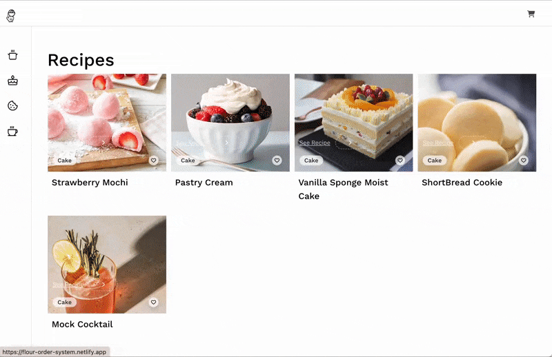

# 🎂 Bakery to Supplier

Make it easier to convert recipes to the amount required to order.
Never spend hours checking and guessing what to order. 


[](https://flour-order-system.netlify.app/)


[
<kbd>
 🎂 Project Link
</kbd>](https://flour-order-system.netlify.app/)


## 👩‍💻 How It's Made:

**Tech used:** HTML, CSS, JavaScript, React, Mongoose Atlas, Redux

FrontEnd - Used React to help create the UI components, tailwind

BackEnd - Used Mongoose Atlas for the backend database


## 🏸 Optimizations

Things I would like to fix/add
- ability to add recipes on the front end
- ability to add supplier database on the front end
- add machine learning given sample data - to guess how much to make for the week


## 📝 Lessons Learned:

In this project, I learned some hard things are worth doing. 

In this case, redux.  

I'm not going to lie...adding redux seemed like a daunting task. With the amount of boilerplate, it seemed intimidating. 

I thought it would be super hard to add to a project but with the help of the redux tool kit, it was surprisingly easy. 

It makes it so much easier to grab information from one location without prop drilling (which can be painful). In the end, struggling and with hard things can be worth it in the future. 


## 👩‍💻 To try the project

Backend
in the .env file 
```
have a Mongoose atlas string as "ATLAS_URI"
npm install 
npm start
```

Frontend
in the .env file
```
replace "REACT_APP_SERVER_URL" with the backend link ie https://localhost:3000/
npm install 
npm start
```


