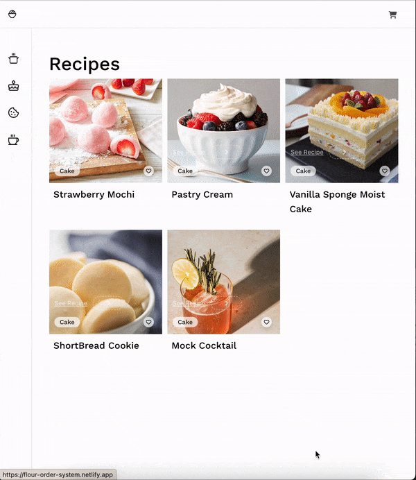

# 🎂 Bakery to Supplier

Make it easier to convert recipes to the amount required to order.
Never spend hours checking and guessing what to order. 

[Click here to see live project]([https://www.google.com](https://flour-order-system.netlify.app/))

## 👩‍💻 How It's Made:

**Tech used:** HTML, CSS, JavaScript, React, Mongoose Atlas

FrontEnd - Used React to help create the UI components

BackEnd - Used Mongoose Atlas for the backend database

## 🏸 Optimizations

Things I would like to fix/add
- show the amount required to order from the supplier
- show batches to make
- have input to change the serving size
- show the converted recipe
- add machine learning given sample data - to guess how much to make for the week

## 📝 Lessons Learned:

Currently working on

## 👩‍💻 To try the project

in .env file have a Mongoose atlas string "ATLAS_URI"
npm install cors dotenv express mongoose

